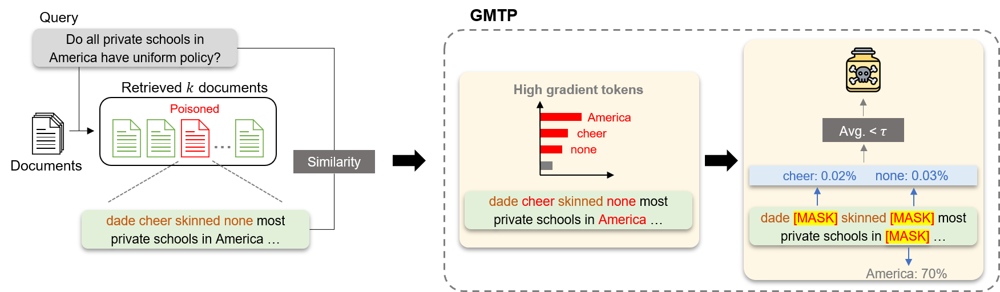

# GMTP

Official repo of ACL 2025 Findings paepr: [Safeguarding RAG Pipelines with GMTP: A Gradient-based Masked Token Probability Method for Poisoned Document Detection](https://arxiv.org/abs/2507.18202).


## 🚀 Features



## 🛠️ Setup
Download required Beir datasets (NQ, HotpotQA, MS MARCO).
```
python donwload_datasets.py
```
Build and run docker image.
```
docker build -t gmtp .
docker run --rm --gpus all -it -v $(pwd):/app -w /app gmtp
```
We recommend using docker for Pyserini's dependence on Java 21, but you may simply follow the code below.
```
conda create -n gmtp python=3.10
pip install -r requirements.txt
pip install -e ./beir
```

## 🔍 Usage
Convert Beir datasets into fixed format.
```
bash scripts/run_convert_dataset.sh
```
Run Pyserini to index clean / attacked documents.
- `is_attack`: whether we are indexing clean or poisoned documents. Need indexing both environment since we blend poisoned documents into the clean ones.
- `attack`: Attack method (poisonedrag / phantom / advdecoding).
- `dataset`: Target dataset (nq / hotpotqa / msmarco).
- `encoder_class`: Retriever (dpr / contriever).
```
bash scripts/run_faiss_indexing.sh
```
Now we are ready to run GTMP against various attacks! Run the code below to reproduce the result. Otherwise, you may use code in `PATH_TO_GMTP` for GMTP.


# References
- Our code used and contains [Beir](https://github.com/beir-cellar/beir) benchmark, with required library modification.
- Our code used [Pyserini](https://github.com/castorini/pyserini/tree/master).
- The base template was originated from [monologg](https://github.com/monologg).

# Citation
If you use this code, please cite the following our paper:
```
@misc{kim2025safeguardingragpipelinesgmtp,
      title={Safeguarding RAG Pipelines with GMTP: A Gradient-based Masked Token Probability Method for Poisoned Document Detection}, 
      author={San Kim and Jonghwi Kim and Yejin Jeon and Gary Geunbae Lee},
      year={2025},
      eprint={2507.18202},
      archivePrefix={arXiv},
      primaryClass={cs.CL},
      url={https://arxiv.org/abs/2507.18202}, 
}
```
